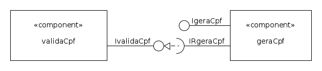

# componentes-de-software-cpp
Exemplo de Componentes de software usando C++

## Componentes

- Este exemplo utiliza dois componentes: Um componente que valida CPF com o cálculo do digito verificador e um que gera CPF com números aleatórios.

- O exemplo utiliza um acoplamento forte, onde o componente gerador requer utilizar a interface do componente verificador.

## Diagrama UML

## Fontes:

[André Santanché - Curso de Componentes de Software](https://www.youtube.com/playlist?list=PL3JRjVnXiTBa5E3pOnAVzd9gy3pZdif7H)
